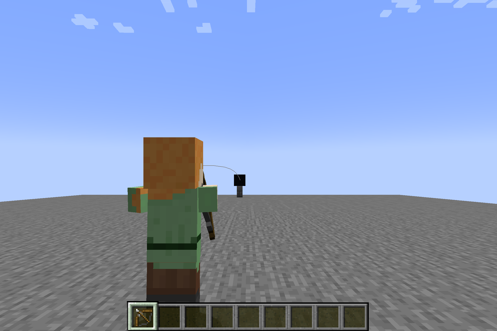
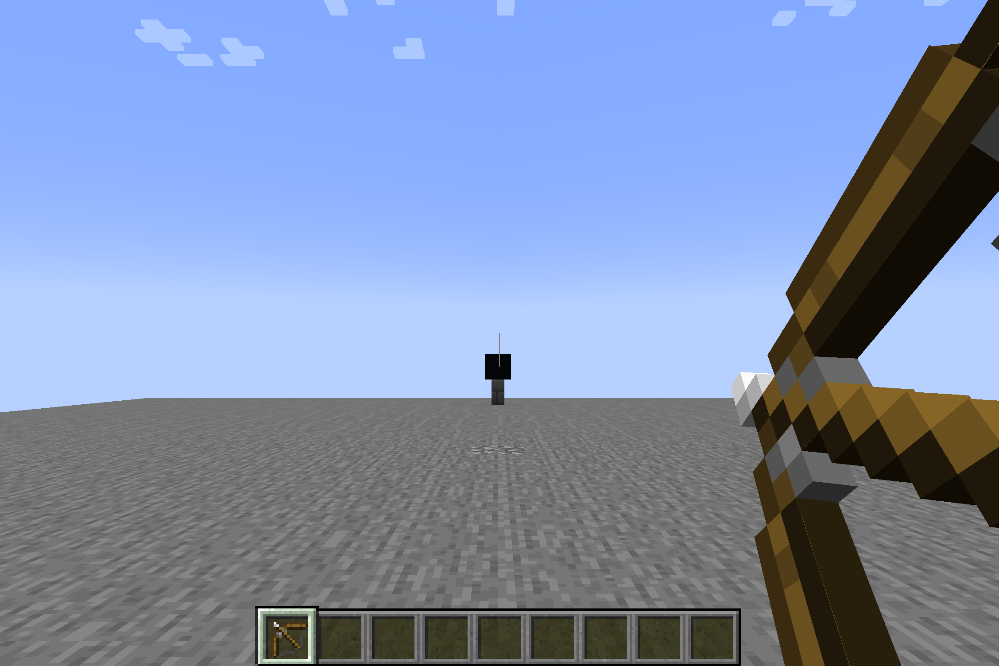

# Robin Hood

Displays a predicted trajectory for projectiles.

## Installation

Make sure you have install fabric loader first. More information about installing Fabric Loader can be found [here](https://fabricmc.net/use/).

To use Robin Hood, download it from [CurseForge](https://www.curseforge.com/minecraft/mc-mods/robinhood), [GitHub Releases](https://github.com/sebastianrasor/robinhood/releases) or [Modrinth](https://modrinth.com/mod/robinhood).

The downloaded jar file should be placed in your `mods` folder.

## Screenshots

